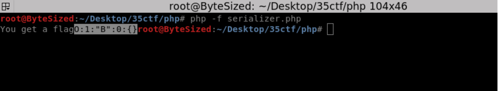
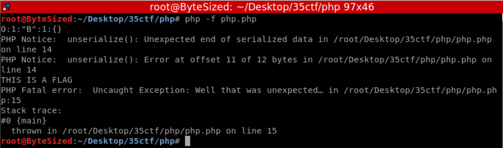

Intro
======
For those not interested in the thought process jump to the bottom for the exploit

To the greatest extent possible, my write ups will focus on explaining my thought process from start to finish so that others who may not have a solid foundation can start to build it here. I will try to make all files available as well so that anyone who wants to can solve these with me.

I am no where near as good at this stuff as some of the people in this field so I may not have many write ups and I may get some things slightly wrong but feel free to correct me! I'm always eager to learn.

Challenge Prompt
------
> PHP's unserialization mechanism can be exceptional. Guest challenge by jvoisin.
> Files at [php.tar](php.tar). Challenge available at `nc 35.242.207.13 1`

## Getting started
The challenge authors were fairly nice with this one - they only provided one _very_ minimal file, seen here

There are a couple things we can recognize from this file immediately:
1. User input is taken from STDIN on line 3 (trim makes sure start/end whitespace is removed)
2. A class is defined, but never used
    * It has a function to echo the flag
3. There is a weird call to `@unserialize` on user-supplied data

Unserialize in any language should be given special attention, some languages handle it better than others...php is not one of them.

## Research
At this point there were a few questions to start asking:

1. What is unserialize and what does it do with data I give it?

	A quick google search for "php unserialize vulnerability" will turn up a large amount of results like [this](https://www.netsparker.com/blog/web-security/untrusted-data-unserialize-php/). You should be able to quickly find that unserialize can be used for a lot of attacks; remote code execution (RCE), object injection, DoS, etc. But we know the challenge authors provided a class for us and it looks like it will give us the flag so we probably don't need RCE and we definitely don't want to attempt a DoS so lets keep object injection in mind.

2. Why does unserialize have `@` at the beginning

	Unfortunately this is one area that I wasn't really able to find a great answer for at the time. Googling for "php @unserialize" only turned up php's documenation with a 5 year old comment
	
	At the time I failed to recognize this for the hidden gem it is. Remember - we are trying to instantiate a class...and now we know that if that fails, php won't just die on us. It supresses the error and continues. 

	If you haven't yet, you should start to wonder why the only method defined in the *B* class is `__destruct`. I will leave it up to you to research this in-depth, but for a quick run down: Php defines several "magic methods" which will execute when certain conditions are met. `__construct` will execute when an object is created and `__destruct` will execute when it is deleted. In PHP an object will be deleted when there are no more references to the object.

3. The challenge prompt mentions that php is "exceptional." What does that have to do with the `throw new Exception` on line 16

	I didn't know this at the time, but it seems that PHP does not run the `__destruct` method for objects when it throws an Exception - Like me, you may not readily find this information but there are ways to figure it out which we will get to. Unfortunately for us, at the bottom of the source code is 
	
	This is going to keep a reference to whatever object is unserialized until after the Exception is thrown, but the program will exit from the Exception so this is never executed. Unfortunate.

For those interested, [this](https://www.evonide.com/fuzzing-unserialize/) was the article I found most useful during my research and I referred to it constantly.

## Testing
I used a quick and dirty method for testing. Using a fresh Kali VM I ran `php -f php.php` on the file that was provided. I also added some "sanity checks" to the script - a couple `var_dump` 's to make sure my input was being read correctly and that I made it past unserialize. I also created another file shown below to create valid serialized data and ran it in a similar fashion.

After some testing I commented out the Exception on line 16 in the challenge script and noticed that the script failed to convert B to a string, removing the echo fixed all issues (The flag message is different because the *B* class in php.php is reading from a flag file) - this is how I discovered that the Exception was blocking an otherwise valid call, first to echo and then to `__destruct` when there were no errors.

## Exploitation
We now know we need a way to create _and_ destroy a *B* object before the Exception on line 16. We also know that `@unserialize` will continue code execution regardless of any errors. Those two pieces of information serve as our exploit path. If we can get unserialize to create a *B* object, but then produce an error and destroy it *without causing php to fail with an Exception* we can get the flag. But remember the `@`? Anything that would cause a fatal exception in unserialize is being supressed so we can cause as many errors there as we want.

The easiest way I could come up with to produce an error was to make it expect data and then not provide it. A serialized *B* object looks like this `O:1:"B":0:{}` the `0:1:"B":0` tells unserialize to create a *B* object with 0 parameters. 

I simply changed the 0 to a 1. `O:1:"B":1:{}`. Unserialize then creates a B object, attempts to find its parameters and when it doesn't it throws an exception. Since the `@` is in front of unserialize, the Exception is surpressed and the invalid object is deleted so we call `__destruct`

Challenge solved.
